# My Outdoor Adventures
An Angular 2 fully responsive website that provides campground search, trip stories, photo upload, and campground rating ability.

### Live URL: https://www.my-outdoor-adventures.com

## What problem does My Outdoor Adventures solve?
People trying to find fun and high-quality camping experiences in an area of interest.

## Who has this problem?
This site was built for Max, a 30 year old city-dwelling guy who likes to camp and needs to find a great campground for his next trip.

## How does your project solve this problem?
This site works on the principle of crowd sourcing. It allows users (adventurers) to find campgrounds and post reports, a picture, and vote on the quality of their experience at the location. The user sourced data, combined with public data allows Max to search for campgrounds that are highly ranked, see some official and adventurer photos, and search within his geographic area.

## What web APIs did it use?
- RIDB - (Recreational Information Database) For campground information.
- Free Geo IP - To pull default city / state from IP address
- Google Maps GeoCoding - To convert city / state names to coordinates
- Cloudinary - Image upload

## What technologies did it use?
- Webpack with Hot Module Reloading
- Angular 2.0 Final Release
- TypeScript 2.0
- Rxjs Observables
- Angular Router, HTTP client, Forms/Validation, Custom Services, Pipes, and Transitions
- Karma/Jasmine View Testing
- Express / Node 6.5
- Postgres with Knex.js
- Heroku
- Eslint for linting JavaScript files
- TSlint for linting TypeScript files
- Atom editor with active linting and TypeScript syntax/type checking
- Angular Material 2
- Materialize with Angular 2 directives
- Bcrypt, Crypto (SHA256) encryption, JSON Web Tokens
- Axios HTTP library.
- Lodash, jQuery
- Github issues

## What was the most valuable piece of Customer feedback you received?
To work on one feature at a time and make it work the way it would be expected by a user. Generating lots of content is not valuable when the content doesn't work properly or make sense to a consumer.

## What was the biggest challenge?
Bringing the complete development environment online with Webpack, hot module reloading, an express server, in-memory transpiling of typescript, live view testing, live linting of JS and TS, and Angular 2 module bootstrapping took quite a while to figure out. The single most troublesome characteristic was figuring out how to make Express send the index file from the in memory transpiled server instead of the file based build folder. An HTTP request was necessary to the in memory server and a piped response to the Express response object.

## Images
### Search Page Desktop View:
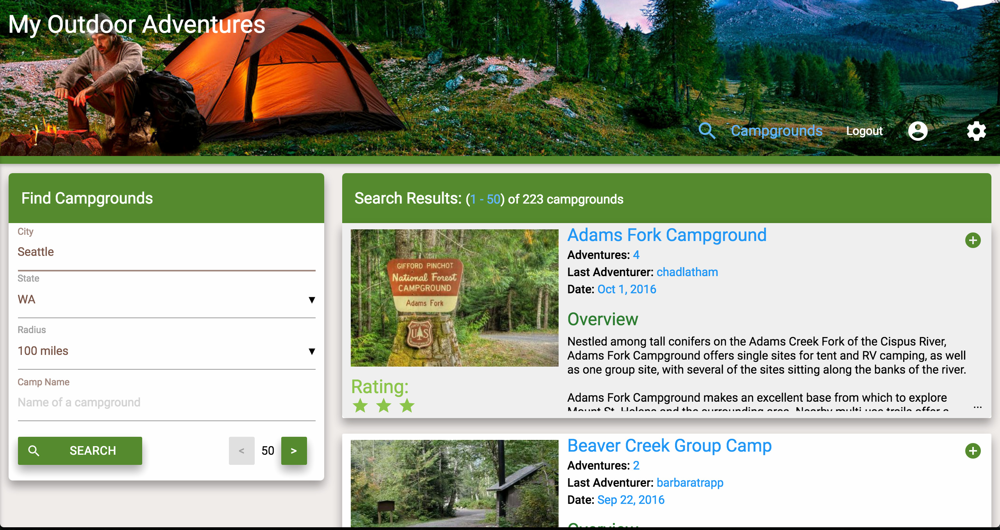

### Search Page Tablet View: All pages are fully responsive
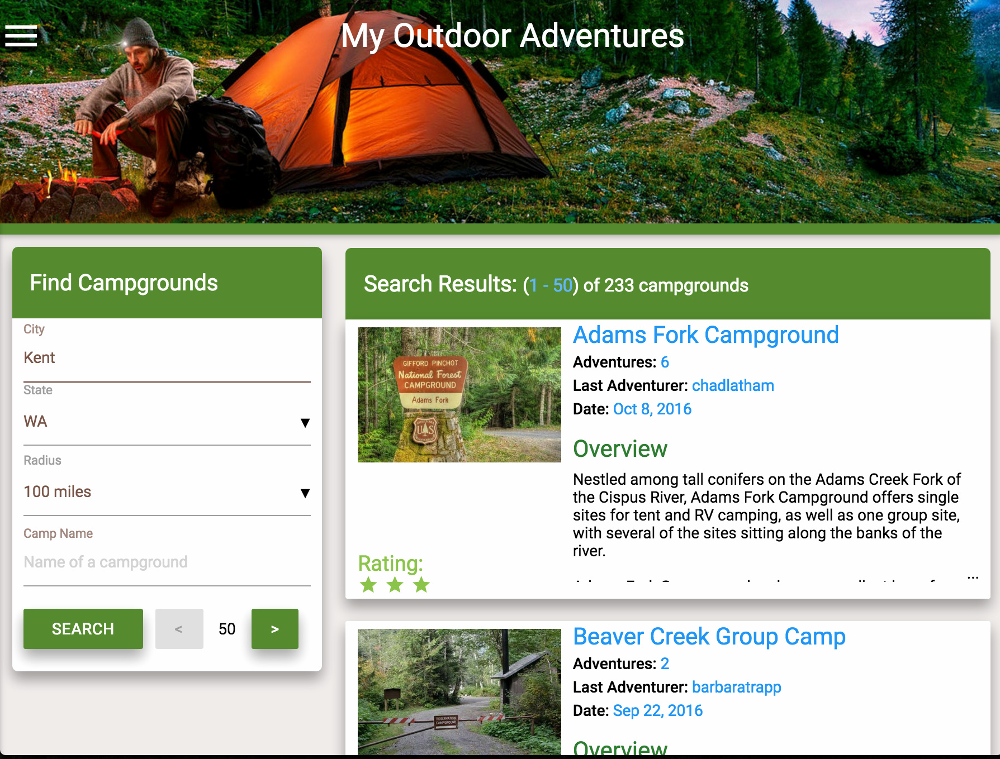

### Search Page Phone View: All pages are fully responsive
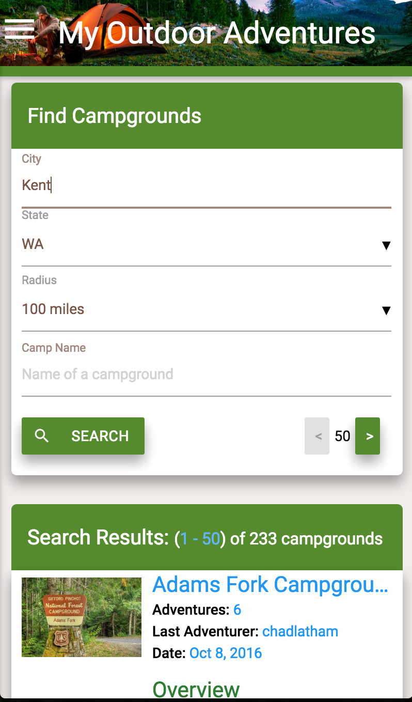

### Campground Details Page Desktop View: All pages are fully responsive
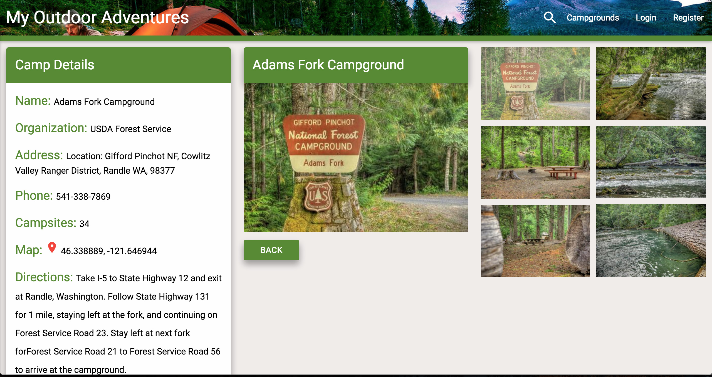

### Campground Details Page Tablet View Part I: All pages are fully responsive
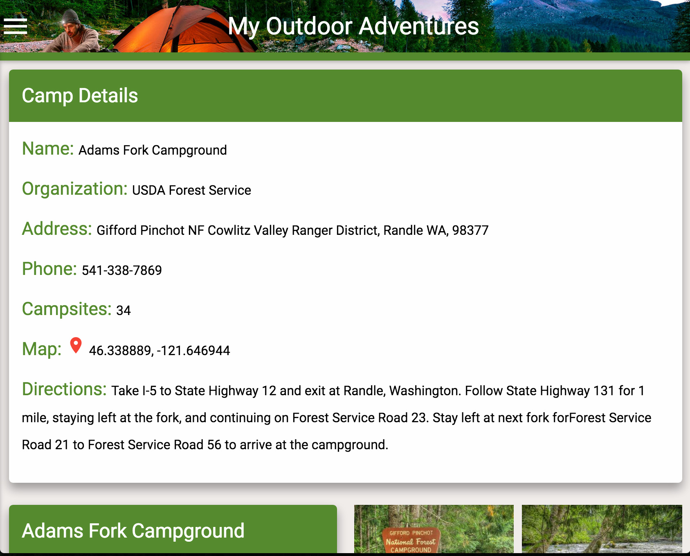

### Campground Details Page Tablet View Part II: All pages are fully responsive
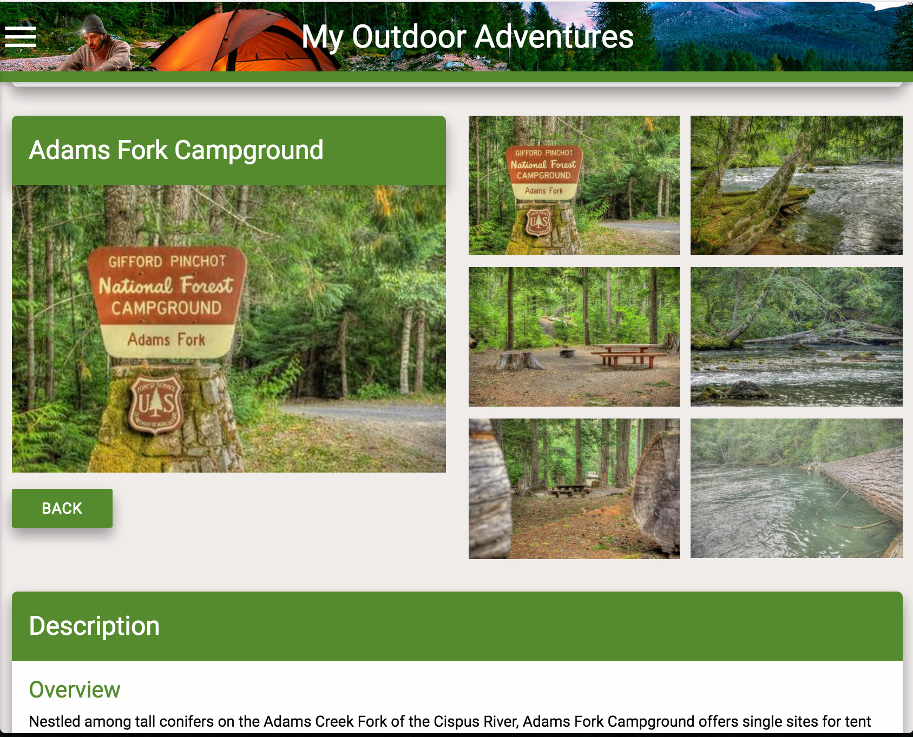

### Login Page:
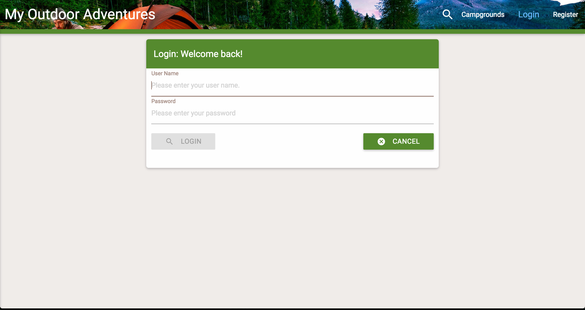

### Registration Page:
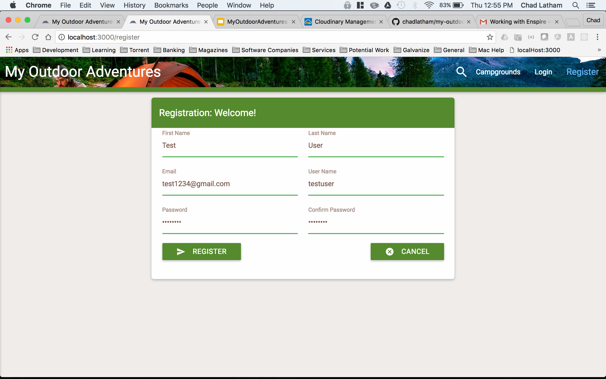

### Adventurer Page:
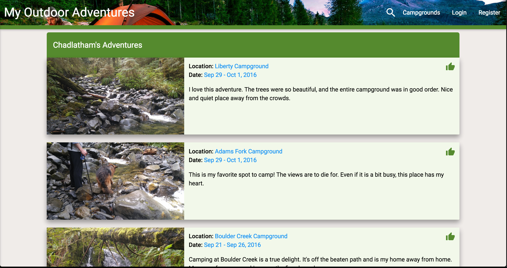

### Adventurer Page Tablet View:
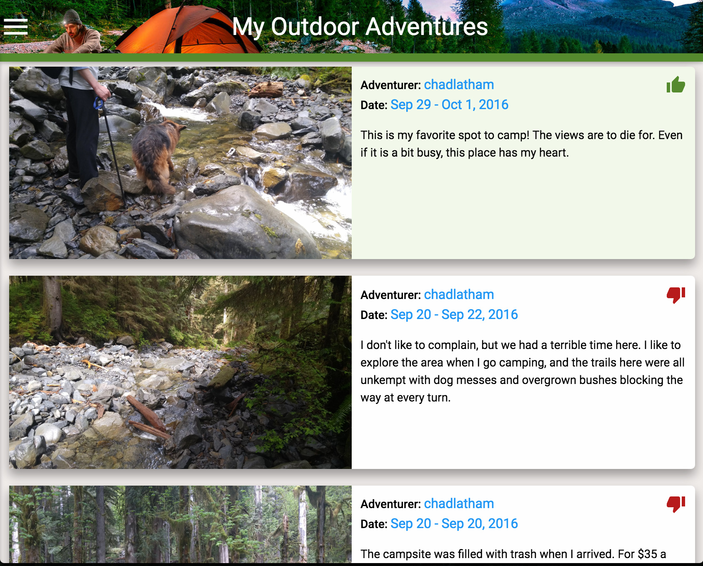

### Adventurer Page Welcome Message:
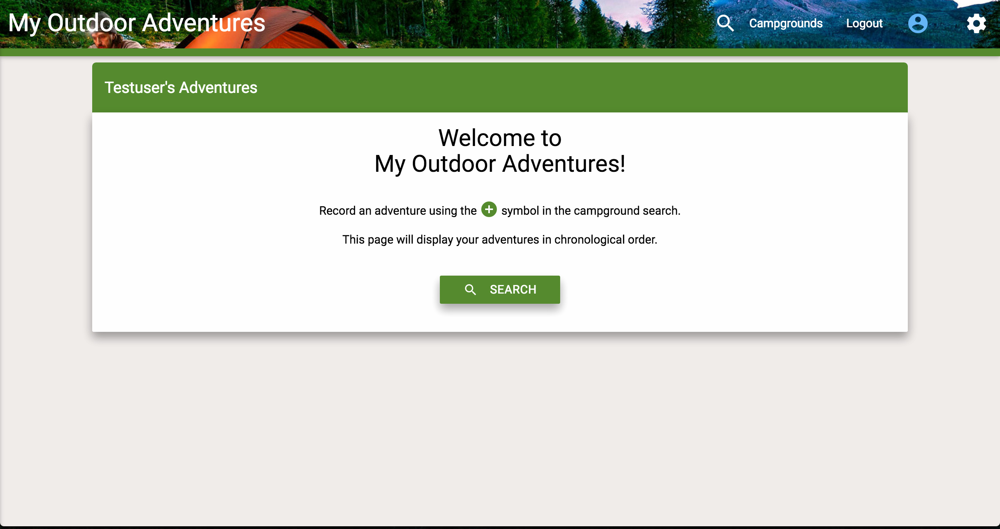

### User Settings Page:
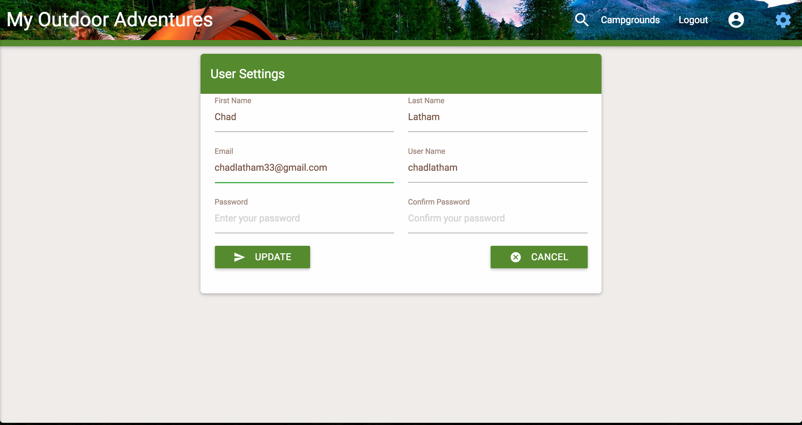

### New Adventure Page:
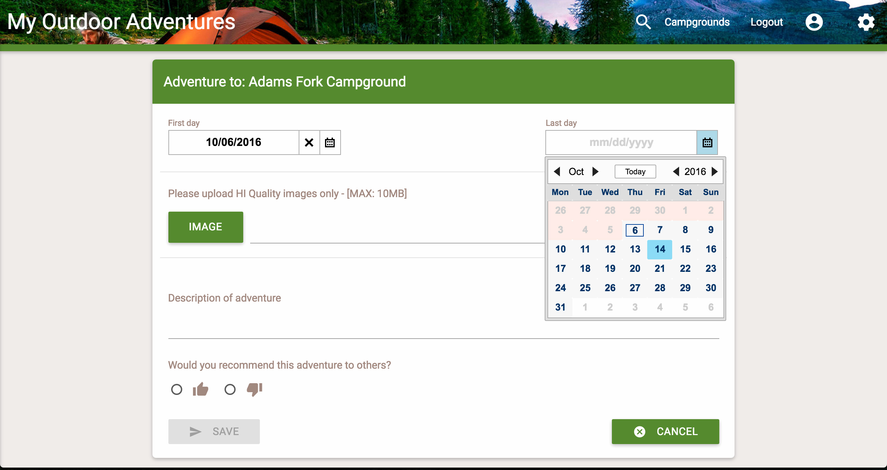

### Mobile Slide-out Side Nav:
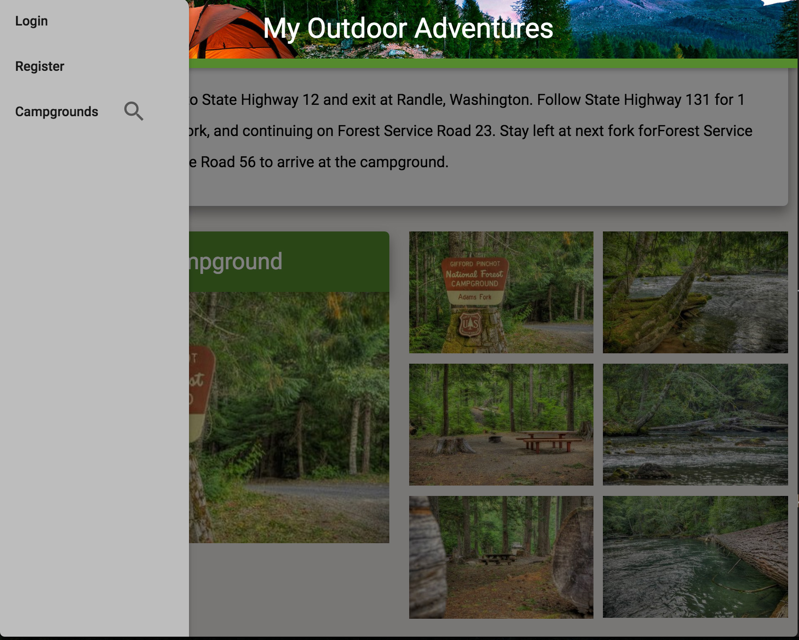
